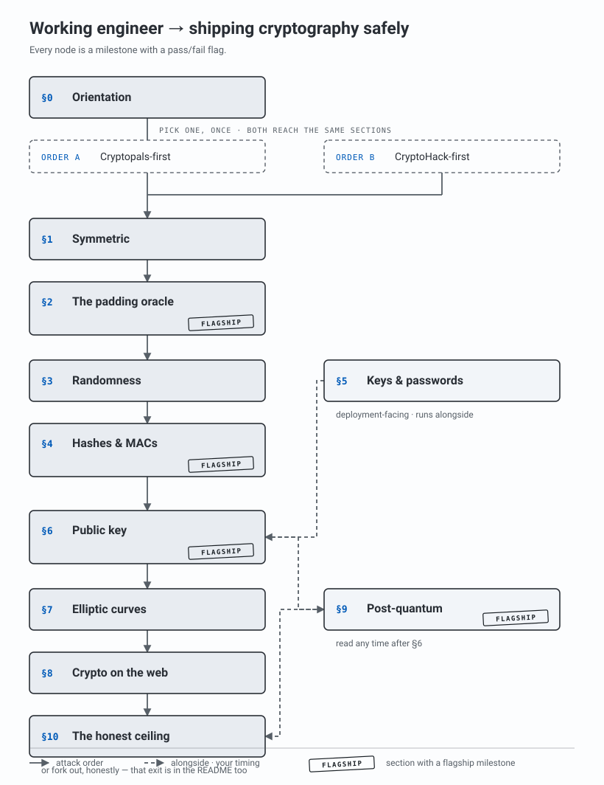

# Applied Cryptography Roadmap

**You probably won't become a cryptographer. You will almost certainly ship cryptography.**

You probably won't become a cryptographer — that takes a Ph.D., and it isn't the author of this map saying so, it's a cryptographer at Brown: *"The best strategy for learning crypto design and theory is to get a Ph.D. at a University with a cryptography group."* But cryptographic failures are [OWASP's #4 application-security risk and 1,665,348 recorded occurrences](https://owasp.org/Top10/2025/A04_2025-Cryptographic_Failures/) — and ordinary engineers are the ones making them. This is a map for *not* making them: through someone else's rigorous material, with milestones you can prove.

## What this is — and what it is not

This is a **map of a competence, not a career**. It is for a working engineer who already touches cryptography — TLS, JWTs, password storage, keys, signatures — and cannot afford to get it wrong, plus anyone facing a post-quantum migration. It sequences material that already exists and is excellent — [Cryptopals](https://cryptopals.com/), [CryptoHack](https://cryptohack.org/), and the standard books — into a route with a verifiable checkpoint at every step.

It is **not** a path to the job title "cryptographer." That market is small and gated behind a Ph.D. ([IACR's board](https://www.iacr.org/jobs/) is ~30 positions, mostly academic); anyone selling you a roadmap *to the title* is selling a fiction. What is not small is the number of engineers who ship crypto bugs. That is who this is for.

And it makes **no cryptographic claims of its own.** Every technical statement here is a quote from a canonical source, linked. Think of the author as a cartographer, not a cryptographer: the map does not tell you what is true about cryptography — it points you at the material that will tell you whether *your code* is right.

## How to read a milestone

Every node is a **milestone**, not a topic. It ends in a flag that either passes or fails — your own working exploit, a solved challenge, a completed course track.

This is the whole design. Seny Kamara, the cryptographer quoted above, names the trap of self-teaching: you cannot tell whether you have actually understood something. *"You have to get to a point where you can reliably tell whether you have fully understood some idea or not. When you are starting out and working alone, this is extremely difficult especially for an area like cryptography which can be so subtle."* Left unchecked, he warns, *"you will end up a crank."*

Cryptopals and CryptoHack answer exactly that: they give a **binary oracle.** The attack decrypts the message or it doesn't; the flag validates or it doesn't. That external check — not this map's opinion — is what tells you that you understood. It is why a map that makes zero claims about cryptography can still be useful.

**Legend.**
- ⭐ — a *flagship* milestone: the famous, hard breaks (plus the one precision milestone that most sets this map apart). There are **four**.
- 🔀 — a *fork*: a point where you choose your path.
- **Articulation milestone** — a node that honestly ends in *"you can state / justify …"* rather than a passing flag, because the thing it checks has no external binary oracle in the canon and inventing one would break this map's one rule. There are **exactly three** — M0.2, M5.2, M10.1 — and each is labeled inline. Everything else ends in a flag that passes or fails.

There is deliberately no leaderboard or "score" here: this niche has no public credential to chase, and the map does not fake one. The flag passing is the whole reward.

## The backbone: OWASP's own checklist

This map's table of contents was not invented. It is [OWASP Top 10:2025, A04 — Cryptographic Failures](https://owasp.org/Top10/2025/A04_2025-Cryptographic_Failures/), whose "How to Prevent" section reads as a list of questions. Each question is a real mistake engineers ship; each maps to a section below where the canon lets you *break* that mistake yourself.

| OWASP A04 checklist question (verbatim) | Section |
|---|---|
| *"Is an insecure mode of operation such as ECB in use?"* · *"Are initialization vectors ignored, reused…?"* | [§1](#1--symmetric-xor-ecb-cbc) |
| *"Are cryptographic error messages or side channel information exploitable, for example in the form of padding oracle attacks?"* | [§2](#2--the-padding-oracle) |
| *"Is randomness used that was not designed to meet cryptographic requirements?"* | [§3](#3--randomness-that-isnt) |
| *"Are deprecated hash functions such as MD5 or SHA1 in use…?"* | [§4](#4--hashes-macs-length-extension-collisions) |
| *"Are passwords being used as cryptographic keys in the absence of a password based key derivation function?"* · *"…keys re-used, or is proper key management and rotation missing?"* · *"Are crypto keys checked into source code repositories?"* | [§5](#5--keys-passwords-and-management) |
| *"Are default crypto keys in use, are weak crypto keys generated…?"* | [§6](#6--public-key-rsa-dsa-diffie-hellman) |
| *(the elliptic-curve primitives underlying §6 and the web)* | [§7](#7--elliptic-curves) |
| *"Is the received server certificate and the trust chain properly validated?"* · *"Can the cryptographic algorithm be downgraded or bypassed?"* · *"Is encryption not enforced…?"* | [§8](#8--crypto-on-the-web-certificates-tls-jwt) |
| *"Are any old or weak cryptographic algorithms or protocols used…?"* (the quantum horizon) | [§9](#9--post-quantum-read-nist-not-the-blogs) |

<sub>All eleven A04 "How to Prevent" questions verified verbatim against the OWASP page on 2026-07-18. The full checklist is worth reading once at [§0](#0--orientation-the-checklist-is-the-map).</sub>

## Pick your order (the fork) 🔀

The one thing the canon *disagrees* on is where to start. This map does not settle the argument — it shows you both sides, verbatim, and lets you choose.

| | **Order A — dive straight in** | **Order B — theory rails first** |
|---|---|---|
| Source | [Cryptopals](https://cryptopals.com/) | [Hopper's Roppers, "How to Learn Cryptography"](https://www.hoppersroppers.org/roadmap/training/crypto.html) |
| The claim | Prerequisites: *"None. That's the point."* — *"If you have any trouble with the math in these problems, you should be able to find a local 9th grader to help you out."* | *"They claim no prior experience required, but I disagree. I think cryptopals should be done after CryptoHack."* Order: CryptoHack → Boneh Cryptography I → Cryptopals. |
| Start at | [§1](#1--symmetric-xor-ecb-cbc) (Cryptopals Set 1) | CryptoHack [Introduction](https://cryptohack.org/courses/intro/) + [Modular Arithmetic](https://cryptohack.org/courses/modular/) courses, then [§1](#1--symmetric-xor-ecb-cbc) |
| Best if | you already code fluently and learn by attacking | you want a gentler ramp with the math named before you meet it |

> Honest note: Cryptopals promises *"None. That's the point."* at the entrance and hands you [Set 8](https://cryptopals.com/sets/8) — its own words: *"you will have written an ad hoc, informally-specified, bug-ridden, slow implementation of one percent of SageMath"* — at the exit. If Order A starts to hurt, Order B is not a retreat; it is the rail the other camp recommends. The sections below are ordered by *attack*, not by *prerequisite* — either camp walks the same sections.

### Where to enter

| You are a… | Enter at |
|---|---|
| Engineer who ships crypto config but has never attacked it (the typical reader) | §0 → Pick-your-order → §1 |
| Engineer already fluent in symmetric attacks | §0 → §2 |

### The map



<sub>Rendered deterministically by `scripts/render_map.py` — edit the data there, not the SVG.</sub>

### Reference companions

Not milestones — books and a guide to keep open as you go, from the canon that owns the term "applied cryptography":

- [*A Graduate Course in Applied Cryptography*, Boneh & Shoup](https://toc.cryptobook.us/) — free PDF, latest **v0.6 (Jan 14, 2023)**; the standard graduate text, still in draft. *(verified 2026-07-18)*
- [The Hitchhiker's Guide to Applied Cryptography](https://github.com/aleph-fbk/The-Hitchhiker-s-Guide-to-Applied-Cryptography) — FBK, CC BY 4.0, **v0.1.3 (2026-07-13)**; *"a series of bite-sized self-contained notes… a reference companion to standard cryptographic literature"* — deliberately unordered, so a companion, not a path. *(verified 2026-07-18)*

---

## Contents

- [§0 — Orientation: the checklist is the map](#0--orientation-the-checklist-is-the-map)
- [§1 — Symmetric: XOR, ECB, CBC](#1--symmetric-xor-ecb-cbc)
- [§2 — The padding oracle](#2--the-padding-oracle)
- [§3 — Randomness that isn't](#3--randomness-that-isnt)
- [§4 — Hashes: MACs, length extension, collisions](#4--hashes-macs-length-extension-collisions)
- [§5 — Keys, passwords, and management](#5--keys-passwords-and-management)
- [§6 — Public key: RSA, DSA, Diffie-Hellman](#6--public-key-rsa-dsa-diffie-hellman)
- [§7 — Elliptic curves](#7--elliptic-curves)
- [§8 — Crypto on the web: certificates, TLS, JWT](#8--crypto-on-the-web-certificates-tls-jwt)
- [§9 — Post-quantum: read NIST, not the blogs](#9--post-quantum-read-nist-not-the-blogs)
- [§10 — The honest ceiling](#10--the-honest-ceiling)
- [Contributing](#contributing) · [License](#license)

---

## §0 — Orientation: the checklist is the map

The fastest way to waste six months is to learn cryptography as a subject instead of as the specific set of mistakes you are paid not to make. This section is short and mandatory.

### M0.1 — Read the checklist, not the vibes

> **You're done when** you can take the eleven questions in OWASP A04's "How to Prevent" checklist and, for a system you actually work on, mark each one *"I can answer this today / I can't."* That marked list is your personal route through this map.

The words that repeat in that checklist — *ECB, IV, padding oracle, PBKDF, deprecated hash, weak key* — are not trivia. Each is a section below, and each ends in a challenge where you break exactly that mistake.

- [OWASP Top 10:2025 — A04 Cryptographic Failures](https://owasp.org/Top10/2025/A04_2025-Cryptographic_Failures/) — the checklist, and the numbers that say this is common: **#4 of 10, 32 CWEs, 1,665,348 total occurrences, 2,185 CVEs.** *(verified 2026-07-18)*

### M0.2 — Know the ceiling *(articulation milestone — labeled honestly)*

> **You're done when** you can state, in two sentences, the difference between *using* cryptography correctly and *designing* it — and name which one this map trains.

This is the honesty that keeps you out of the crank trap. Kamara draws the line himself, and explicitly puts engineering outside his own expertise: *"If your end goal is crypto engineering then the strategies may or may not be helpful — I'm not an expert so I can't really say either way."* This map trains the first thing (use it without shooting yourself); the second forks out at [§10](#10--the-honest-ceiling). It ends in *"you can state,"* not a flag — one of this map's three articulation milestones, called out so you know the difference.

- [Seny Kamara, "How Not to Learn Cryptography" (Brown, 2014)](https://esl.cs.brown.edu/blog/how-not-to-learn-cryptography/) — read for the *strategy vs. list* argument and the honest ceiling. A frame to adopt, not a resource to complete.

---

## §1 — Symmetric: XOR, ECB, CBC
> *OWASP A04: "Is an insecure mode of operation such as ECB in use?" · "Are initialization vectors ignored, reused…?"*

### M1.1 — The qualifying set

> **You're done when** [Cryptopals Set 1](https://cryptopals.com/sets/1) passes — all 8 challenges, "Convert hex to base64" through "Detect AES in ECB mode."

Cryptopals calls Set 1 *"the qualifying set… we picked the exercises in it to ramp developers up gradually into coding cryptography, but also to verify that we were working with people who were ready to write code."* Don't skip it: *"At least two of them (we won't say which) are important stepping stones to later attacks."*

- [Cryptopals Set 1](https://cryptopals.com/sets/1) — challenges 1–8. *(verified 2026-07-18)*

### M1.2 — ECB is not encryption you can trust

> **You're done when** Cryptopals **#11 (An ECB/CBC detection oracle)** and **#12 (Byte-at-a-time ECB decryption, Simple)** pass — you recover an ECB-protected secret one byte at a time.

The hands-on answer, in your own working code, to OWASP's *"Is an insecure mode of operation such as ECB in use?"* You will never look at an ECB config the same way after decrypting one.

- [Cryptopals Set 2](https://cryptopals.com/sets/2) — challenges 11–14 (detection oracle, byte-at-a-time simple/harder, cut-and-paste). *(verified 2026-07-18)*

### M1.3 — Bend CBC to your will

> **You're done when** Cryptopals **#16 (CBC bitflipping attacks)** passes — you flip ciphertext bits to forge the plaintext you want.

The hands-on form of OWASP's *"Are initialization vectors ignored, reused, or not generated sufficiently secure for the cryptographic mode of operation?"*

- [Cryptopals Set 2](https://cryptopals.com/sets/2) — challenges 15–16 (PKCS#7 validation, CBC bitflipping). *(verified 2026-07-18)*

> 🔀 **Guided alternative for this whole section.** If you took Order B, the same ground with tests and hints is the [CryptoHack **Symmetric Cryptography** course](https://cryptohack.org/courses/symmetric/) — Intermediate, 14 lessons. *(verified 2026-07-18)*

---

## §2 — The padding oracle
> *OWASP A04: "Are cryptographic error messages or side channel information exploitable, for example in the form of padding oracle attacks?"*

### M2.1 — ⭐ Break CBC with a single yes/no leak

> **You're done when** Cryptopals **#17 (The CBC padding oracle)** passes — you recover the entire plaintext from a server whose only leak is *"valid padding / invalid padding."*

This is the most famous milestone in the niche, and it is the OWASP checklist item spelled out verbatim: *"…in the form of padding oracle attacks."* One bit of error information, fully exploited.

- [Cryptopals Set 3](https://cryptopals.com/sets/3) — challenge 17. *(verified 2026-07-18)*

---

## §3 — Randomness that isn't
> *OWASP A04: "Is randomness used that was not designed to meet cryptographic requirements?"*

### M3.1 — Predict the "random"

> **You're done when** Cryptopals **#23 (Clone an MT19937 RNG from its output)** passes — you reconstruct a generator's entire future stream from its past outputs.

The direct answer to OWASP's randomness question: a PRNG never meant for cryptography leaks its whole state. Challenges 21–24 walk you from implementing MT19937 to breaking a cipher built on it.

- [Cryptopals Set 3](https://cryptopals.com/sets/3) — challenges 21–24 (implement MT19937, crack the seed, clone from output, MT stream cipher). *(verified 2026-07-18)*

### M3.2 — Nonce misuse in stream mode

> **You're done when** Cryptopals **#19–20 (Break fixed-nonce CTR)** pass — you decrypt messages that reused a keystream.

- [Cryptopals Set 3](https://cryptopals.com/sets/3) — challenges 18–20 · [Set 4](https://cryptopals.com/sets/4) — challenges 25–26 (CTR random-access & bitflipping). *(verified 2026-07-18)*

---

## §4 — Hashes: MACs, length extension, collisions
> *OWASP A04: "Are deprecated hash functions such as MD5 or SHA1 in use, or are non-cryptographic hash functions used when cryptographic hash functions are needed?"*

### M4.1 — ⭐ Forge a signature without the key

> **You're done when** Cryptopals **#29 (Break a SHA-1 keyed MAC using length extension)** passes — you append to a signed message and produce a valid MAC without ever knowing the secret.

The hands-on form of OWASP's warning against SHA-1/MD5: the length-extension weakness makes an `H(secret ‖ message)` MAC forgeable. Challenges 28–30 cover SHA-1 and MD4; 31–32 add an HMAC timing leak.

- [Cryptopals Set 4](https://cryptopals.com/sets/4) — challenges 28–32. *(verified 2026-07-18)*

### M4.2 — The rest of the hash attacks

> **You're done when** the [CryptoHack **Hashes** category](https://cryptohack.org/challenges/hashes/) (14 challenges) is complete — or, for the harder track, [Cryptopals Set 7](https://cryptopals.com/sets/7) (#49–56: CBC-MAC forgery, hash multicollisions, a compression-ratio side channel, MD4 collisions, RC4 biases).

- [CryptoHack Hashes](https://cryptohack.org/challenges/hashes/) — 14 challenges *(count verified 2026-07-18)* · [Cryptopals Set 7](https://cryptopals.com/sets/7) *(challenge list verified 2026-07-18)*. Pick by appetite ("3 excellent > 10 average" — you don't need both).

---

## §5 — Keys, passwords, and management
> *OWASP A04: "Are passwords being used as cryptographic keys in the absence of a password based key derivation function?" · "…are keys re-used, or is proper key management and rotation missing?" · "Are crypto keys checked into source code repositories?"*

Honest note: Cryptopals and CryptoHack have **no failable challenge** for these three OWASP items (verified 2026-07-18 — neither has a KDF or key-management track). So this section does what it can make *checkable* with an outside tool, and is openly labeled where it can't.

### M5.1 — Catch the key you checked in

> **You're done when** a secrets scanner catches a test key you deliberately planted in a repo you own — and a clean run afterward reports **zero findings.**

The pass/fail answer to OWASP's *"Are crypto keys checked into source code repositories?"* — the tool is the oracle.

- [gitleaks](https://github.com/gitleaks/gitleaks) — MIT, 28k★, actively patched secrets scanner (git history, directories, pre-commit, CI). *(verified 2026-07-18)*

### M5.2 — Store passwords like you mean it *(articulation milestone — labeled honestly)*

> **You're done when** you can justify a password-storage choice (Argon2id / scrypt / bcrypt, with concrete parameters) against the **OWASP Password Storage Cheat Sheet**, and point to one place in a codebase you own where a raw password — or a fast hash — is used as, or as the input to, a key.

This ends in *"you can justify,"* not a flag — one of this map's three articulation milestones. It is labeled that way openly, because the OWASP item *"passwords used as cryptographic keys in the absence of a PBKDF"* has no external binary oracle in the canon, and inventing one would break this map's one rule (no cryptography of our own). The cheat sheet is unambiguous: *"Fast hashing algorithms such as SHA-256 are not suitable for password storage,"* and it recommends *"Argon2id with a minimum configuration of 19 MiB of memory, an iteration count of 2, and 1 degree of parallelism"* (fallbacks: scrypt, bcrypt, PBKDF2 for FIPS).

- [OWASP Password Storage Cheat Sheet](https://cheatsheetseries.owasp.org/cheatsheets/Password_Storage_Cheat_Sheet.html) — the current parameters, verbatim. *(verified 2026-07-18)*
- [*Serious Cryptography*, 2nd ed. (Aumasson, No Starch, 2024)](https://openlibrary.org/books/OL52232145M/Serious_Cryptography_2nd_Edition) — the KDF chapter for the *why*. *(edition verified 2026-07-18)*

---

## §6 — Public key: RSA, DSA, Diffie-Hellman
> *OWASP A04: "Are default crypto keys in use, are weak crypto keys generated…?"*

### M6.1 — Man in the middle of a key exchange

> **You're done when** Cryptopals **#34–35 (MITM key-fixing on Diffie-Hellman with parameter injection; break with malicious "g")** pass — you sit between two parties and read the "secure" channel.

- [Cryptopals Set 5](https://cryptopals.com/sets/5) — challenges 33–40 (implement DH, MITM, SRP, implement RSA, E=3 broadcast). *(verified 2026-07-18)* · [CryptoHack **Diffie-Hellman** category](https://cryptohack.org/challenges/diffie-hellman/) — 14 challenges *(count verified 2026-07-18)*.

### M6.2 — ⭐ Break real RSA padding

> **You're done when** Cryptopals **#47–48 (Bleichenbacher's PKCS 1.5 padding oracle, simple then complete)** pass.

Cryptopals introduces #47 with its own warning: *"These next two challenges are the hardest in the entire set."* Earlier RSA/DSA challenges build to it: #46 RSA parity oracle, #42 Bleichenbacher e=3 signature forgery, #43–44 DSA key recovery from a bad nonce.

- [Cryptopals Set 6](https://cryptopals.com/sets/6) — challenges 41–48. *(verified 2026-07-18)* · [CryptoHack **RSA** category](https://cryptohack.org/challenges/rsa/) — 29 challenges *(count verified 2026-07-18)*.

> 🔀 **Guided alternative + theory complement.** [CryptoHack **Public-Key Cryptography** course](https://cryptohack.org/courses/public-key/) (Intermediate, 18 lessons) for the guided path; [Boneh, Cryptography I](https://www.coursera.org/learn/crypto) (Stanford; **541,667 enrolled, 4.8★, 7 modules**) for the theory rails Order B places here. *(both verified 2026-07-18)*

---

## §7 — Elliptic curves
> *The primitive under modern TLS, signatures, and much of §6 — its own track because it has its own failure modes.*

### M7.1 — Curves, and how they break

> **You're done when** the [CryptoHack **Elliptic Curves** course](https://cryptohack.org/courses/elliptic/) (Hard, 11 lessons) is complete.

For the far end, Cryptopals Set 8 turns EC into attacks: #59 invalid-curve attacks on ECDH, #60 insecure twists, #61–62 ECDSA duplicate-signature and biased-nonce key recovery.

- [CryptoHack Elliptic Curves course](https://cryptohack.org/courses/elliptic/) + [**ECC** category](https://cryptohack.org/challenges/ecc/) — 23 challenges. *(verified 2026-07-18)* · [Cryptopals Set 8](https://cryptopals.com/sets/8), #57–62 *(challenge list verified 2026-07-18)*.

---

## §8 — Crypto on the web: certificates, TLS, JWT
> *OWASP A04: "Is the received server certificate and the trust chain properly validated?" · "Can the cryptographic algorithm be downgraded or bypassed?" · "Is encryption not enforced…?"*

### M8.1 — Break the transport, not just the primitive

> **You're done when** the [CryptoHack **Crypto on the Web** category](https://cryptohack.org/challenges/web/) (17 challenges) is complete — JWTs, the TLS handshake, and algorithm-confusion downgrades.

This is where the primitives you broke above meet the protocol that ships them. The category covers all three OWASP web questions: JWT handling (7 challenges, incl. the *"RSA or HMAC?"* algorithm-downgrade confusion), the TLS protocol and handshake (7 challenges, incl. decrypting TLS 1.2 and 1.3), and cloud key handling (3).

- [CryptoHack "Crypto on the Web"](https://cryptohack.org/challenges/web/) — 17 challenges across JSON Web Tokens, TLS, and Cloud. *(category & coverage verified 2026-07-18)*

---

## §9 — Post-quantum: read NIST, not the blogs
> *This section is the map's precision differentiator. The blogosphere sells a "2030 NIST mandate"; the primary source says something more exact, and saying it exactly is the point.*

### M9.1 — ⭐ Read the primary source, not the headline

> **You're done when** you can, from the NIST primary source (not a blog), state three things: (1) that NIST IR 8547 is an **Initial Public Draft**, not a final standard; (2) NIST's verbatim definitions of *deprecated* and *disallowed*; (3) the transition dates for ECDSA/EdDSA — and explain why the headline "NIST mandates 2030" is imprecise.

Verified against the primary source on **2026-07-18**: `https://csrc.nist.gov/pubs/ir/8547/final` still returns **HTTP 404**; the live document is [NIST IR 8547, *Transition to Post-Quantum Cryptography Standards*, **Initial Public Draft**, published 2024-11-12](https://csrc.nist.gov/pubs/ir/8547/ipd) (comment period closed 2025-01-10). NIST's own definitions, quoted from the draft:

> *"**Deprecated** means that the algorithm and key length/strength may be used, but there is some security risk. The data owner must examine this risk potential and decide whether to continue to use a deprecated algorithm or key length."*
>
> *"**Disallowed** means that the algorithm, key length/strength, parameter set, or scheme is no longer allowed for the stated purpose."*

And from **Table 3, "Post-quantum digital signature algorithms"** (quoted verbatim from the draft PDF):

> ECDSA — 112 bits of security strength: **Deprecated after 2030, Disallowed after 2035.**
> ECDSA — ≥ 128 bits of security strength: **Disallowed after 2035.**
> EdDSA — ≥ 128 bits of security strength: **Disallowed after 2035.**

Why the headline is imprecise: the draft itself notes that SP 800-57 *"had projected that NIST would disallow public-key schemes that provide 112 bits of security on January 1, 2031,"* and that NIST now *"intends to instead deprecate"* them — i.e., the exact word (deprecate vs. disallow) and the exact year are draft intentions, not a finalized standard. Knowing that difference is the whole milestone.

- [NIST IR 8547 ipd](https://csrc.nist.gov/pubs/ir/8547/ipd) · [NIST draft-publications list](https://pages.nist.gov/NIST-Tech-Pubs/DRAFT.html) — the status check anyone can repeat. *(both verified 2026-07-18)*
- Do-resource: the CryptoHack [post-quantum](https://cryptohack.org/challenges/post-quantum/) (18) and [isogenies](https://cryptohack.org/challenges/isogenies/) (23) categories — the hands-on side of the schemes NIST is standardizing. *(counts verified 2026-07-18)*

---

## §10 — The honest ceiling

### M10.1 — 🔀 Know where this map stops *(articulation milestone — labeled honestly)*

> **You're done when** you can read the [Cryptopals Set 8](https://cryptopals.com/sets/8) warning and decide, honestly, whether that is your road — and understand that if it is, the next step is not this map.

Cryptopals states it themselves: Set 8 is *"really tough… more demanding than anything we've released so far,"* and by the end *"you will have written an ad hoc, informally-specified, bug-ridden, slow implementation of one percent of SageMath."* That is the border between *using* cryptography and *designing* it. Kamara's answer for the far side is unambiguous: *"The best strategy for learning crypto design and theory is to get a Ph.D."* This map got you to use cryptography without shooting yourself. Designing it is a different journey, and it forks out here. Like M0.2 and M5.2, this ends in a decision you make, not a flag — the third and last articulation milestone.

- [Cryptopals Set 8](https://cryptopals.com/sets/8) — challenges 57–66. *(verified 2026-07-18)* · [Kamara, "How Not to Learn Cryptography"](https://esl.cs.brown.edu/blog/how-not-to-learn-cryptography/).

---

## Order and dependencies

```
Pick your order 🔀
  Order A (Cryptopals-first) ─┐
  Order B (CryptoHack-first) ─┴─► §1 Symmetric ─► §2 Padding oracle ─► §3 Randomness ─► §4 Hashes
                                                                                          │
        §5 Keys / passwords / mgmt   (deployment-facing; runs alongside) ─────────────────┤
                                                                                          ▼
                                          §6 Public key ─► §7 Elliptic curves ─► §8 Crypto on the web
                                                                                          │
                                          §9 Post-quantum   (read anytime after §6) ──────┤
                                                                                          ▼
                                                             §10 The honest ceiling / fork out
```

**Forks:**
- **Order A vs B** — chosen once, at the start; both walk the same attack-ordered sections.
- **At §10** — if primitive *design* is the part you can't stop thinking about, the honest exit is out of this map, toward graduate study (Kamara).

---

## Contributing

This roadmap lives or dies by one rule: **every node is a checkable milestone, not a keyword** — and, because the author is a cartographer and not a cryptographer, **every cryptographic claim is a quote from a canonical source, never our own.** See [CONTRIBUTING.md](CONTRIBUTING.md) for the quality gate. Suggestions welcome via the issue templates.

## License

Content is licensed **CC BY-SA 4.0**; the code in [`scripts/`](scripts/) is MIT. Share and adapt freely with attribution.

<sub>Part of the **proofstone** series of frontier-engineering roadmaps — sibling map: [ai-safety-engineer-roadmap](https://github.com/proofstone/ai-safety-engineer-roadmap). Every claim on this page was verified against a live primary source on the date noted beside it.</sub>
